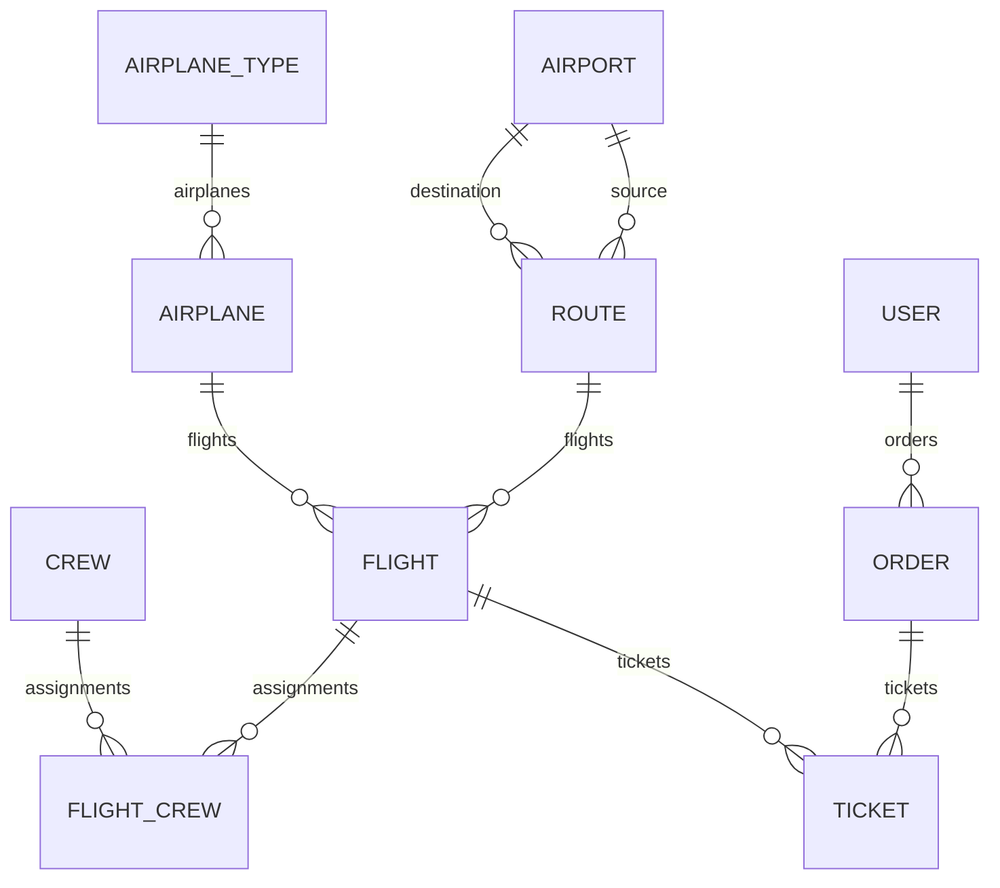

# Database structure for draw.io

Each table below has an `id` primary key (BigAutoField).
`*_id` denotes a physical foreign key column.

| Table / model | Fields other than id |
| --- | --- |
| `user_user` / User | email UNIQUE, password (hash), first_name, last_name, is_staff, is_active, is_superuser, last_login NULL, date_joined. No username field. |
| `airport_airport` / Airport | name UNIQUE, closest_big_city |
| `airport_route` / Route | source_id FK → Airport, destination_id FK → Airport, distance (km) |
| `airport_airplanetype` / AirplaneType | name UNIQUE |
| `airport_airplane` / Airplane | name, rows, seats_in_row, airplane_type_id FK → AirplaneType |
| `airport_crew` / Crew | first_name, last_name |
| `airport_flight` / Flight | route_id FK → Route, airplane_id FK → Airplane, departure_time, arrival_time |
| `airport_flight_crew` / automatically generated join table | flight_id FK → Flight, crew_id FK → Crew; UNIQUE(flight_id, crew_id) |
| `airport_order` / Order | created_at, user_id FK → User |
| `airport_ticket` / Ticket | row, seat, flight_id FK → Flight, order_id FK → Order |

## Relationships

Every foreign key in the application tables is required. A parent may have 0..N
child rows. All these foreign keys use `on_delete=CASCADE`: deleting a parent
through Django deletes related records. For example, deleting a flight deletes
its tickets.

1. Airport **1 → N** Route through source: departure airport (`routes_from`).
2. Airport **1 → N** Route through destination: arrival airport (`routes_to`).
3. Route **1 → N** Flight.
4. AirplaneType **1 → N** Airplane.
5. Airplane **1 → N** Flight.
6. Flight **N ↔ M** Crew through `airport_flight_crew`. A flight may have no crew assigned.
7. User **1 → N** Order.
8. Order **1 → N** Ticket. The API requires at least one ticket when creating
   an order; the database itself permits orders without tickets.
9. Flight **1 → N** Ticket.

Route has UNIQUE(source_id, destination_id): the reverse direction is a different route.
Ticket has UNIQUE(flight_id, row, seat): a seat cannot be booked twice on the same flight.
`capacity`, `full_name`, `tickets_available`, and `taken_seats` are computed,
not database columns.
The checks `source != destination` and `arrival_time > departure_time` live
in `model.clean()`, not SQL constraints. Neither `save()` nor ModelSerializer
automatically calls `full_clean()`; enforcing these checks through the API is
a separate potential improvement.

## Drawing the diagram

Enable the Entity Relation library in draw.io. Create one box per table and
mark PK, FK, and UNIQUE fields. Place Airport to the left of Route and draw
**two** connections labeled source and destination. Put Flight in the center,
Airplane and AirplaneType above it, Crew and the join table to the right,
and Ticket → Order → User below it. Use crow's foot notation for N.

## Django system tables

For a complete physical diagram, also include:

- `auth_group`: id, name UNIQUE.
- `django_content_type`: id, app_label, model; UNIQUE(app_label, model).
- `auth_permission`: id, name, codename, content_type_id FK;
  UNIQUE(content_type_id, codename). ContentType 1 → N Permission.
- `auth_group_permissions`: id, group_id, permission_id; Group N ↔ M Permission.
- `user_user_groups`: id, user_id, group_id; User N ↔ M Group.
- `user_user_user_permissions`: id, user_id, permission_id; User N ↔ M Permission.
- Each of the three M2M tables above has a unique pair of foreign keys.
- `django_admin_log`: id, action_time, user_id FK, content_type_id nullable FK,
  object_id nullable, object_repr, action_flag, change_message. User 1 → N Log
  (CASCADE), ContentType 1 → N Log (SET_NULL); object_id is not a regular FK.
- `django_session`: session_key PK, session_data, expire_date; no regular FK to User.
- `django_migrations`: id, app, name, applied; migration history, without foreign keys.

JWT access/refresh tokens are not stored as separate records: the blacklist
application is not installed. The first ten application tables are usually
sufficient for the PR diagram.
